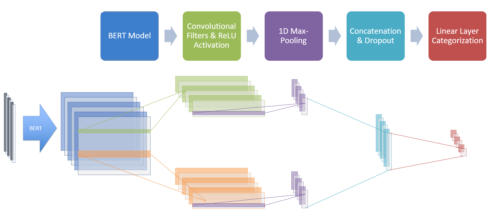

```{r setup, include=FALSE}
knitr::opts_chunk$set(echo = FALSE)

# Load dependencies 
library(reticulate) # For rendering Python code 
```

## Abstract 

This paper presents results for different machine learning methods to predict student loan default in FIES, the most prominent student loan program in Brazil. We employed  five methods: logistic regression, decision trees, support vector machines, random forest, and neural networks.

The neural networks showed the best results, followed by random forest, logistic regression, linear SVM, and decision trees. The best models were then combined in an ensemble model using Weighted Average (AvgW). Compared to the baseline, the results were improved by 6.6%. The values of the area under the curve obtained exceeded those available in the related literature. Our model showed to be an excellent tool to predict default and promote the sustainability of the FIES fund. Based on a feature importance analysis, loan-value related features are the most important predictors of loan defaults. The main application of our findings s on the evaluation of the loan program and possible points  for improvement, and not as a way to decide who receives the loan.


## Introduction / Background

Machine learning algorithms have been used extensively to predict credit risk in the context of consumer loans (Kruppa et al., 2013; Yeh and hui Lien, 2009). Educational loans are similar to consumer loans in many respects but have some unique features, such as increased uncertainty
about the borrower’s characteristics at the time of repayment. In addition, student loans are tied to more extended repayment periods and little or no collateral, leading to more difficult lender risk assessment.

In Brazil, the most prominent educational loan program is FIES (Financiamento Estudantil). Its goal is to provide loans to students with better interest rates compared to the market; the program is partially public-funded. Between 2009 and 2015, more than 2 million students received a loan
through the FIES program. We used a database that contains information on more than 600,000 students who received the loan from the FIES program. The database refers to the position in 2021 of
loans contracted in 2015. Each row of the dataset corresponds to a contract and contains information on loan compliance, the number of days of noncompliance, and a loan default dummy. Also, for each contract, there is information about each student, such as family income, whether or not she has a job, gender, race, what course she is taking, marital status, whether or not the student attended a public
high school, and so on. Each of these variables is a possible predictor of loan default. The data sources are the Ministry of Education and the financial institutions that administer the loan; the Brazilian National Treasury compiled the final database.


This paper adds to the existing literature by analyzing novel data on the FIES program released by the National Treasury Secretariat to investigate the classification accuracy of machine learning algorithms for screening education borrowers. In addition, we explore the key drivers of repayment to provide key insights into this particular setting and provide evidence-based policy recommendations to promote the sustainability of this loan fund. 


Finally, we provide insights into the ethical implications of our findings
for the student loan granting process in Brazil. As expected, our results show that an ensemble model is better able to provide accurate classification information about student credit risk for such a dataset, as our ensemble model outperforms all non-ensemble models. Loan value related features are the most important predictors of loan default in our model. This could be a source of bias if we consider that subgroups borrowing certain loan values could be included or excluded when applying our model.


## Related Work 

This work relates to studies that apply machine learning algorithms to credit scoring applications. Han (2019) employs many different algorithms to predict loan repayment for a lending club, focusing mainly on the insights gained from the predictive features. The algorithm with the best performance was logistic regression, followed by random forest, k-nearest neighbors, and support vector machines. Liang et al. (2019) use five different algorithms to accomplish the same task. The methods are: logistic regression, random forest, Naive Bayes, LightGBM and neural networks. The authors find that logistic regression, multilayer perceptron (neural networks), and random forest are the best algorithms. In addition, number of days employed and age are the strongest predictors of loan repayment in their data.

Lessmann et al. (2015) conduct a benchmark study for 41 classification methods over eight credit scoring datasets. The results show that many classifiers predict credit default outcomes better than the industry standard – logistic regression. Heterogeneous ensemble classifiers, such as direct selective
ensembles, perform remarkably well in their study.

Stelzer (2019) conducts a similar benchmark study using 23 machine learning methods. She applies five data sampling strategies to combat existing class imbalances in the data. The results show that simple up-sampling or down-sampling yields the best predictive performance in the face of unequal class distributions. In the Brazilian context, Aniceto et al. (2020) study the performance of different methods for predicting loan defaults with a dataset of loans provided by a Brazilian bank. They use logistic regression as a baseline and conclude that ensemble methods perform better.

In the context of student loans, in a working paper, Jayadev et al. (2019) apply machine learning models to predict defaults on education loans, taking into account borrower-specific characteristics such as income, university, geographic region, as well as systematic factors such as growth rate, inflation, and unemployment rate. They find that ”ensemble models tend to perform better than simple artificial techniques and statistical models and that the performance can be improved significantly by model stacking” (p. 27).


**See below for an example of how to cite related work in Markdown.**

Bidirectional Encoder Representations from Transformers (BERT) have proven successful in prior attempts to classify phrases and short texts [@devlin2018bert].

**Footnotes and Sidenotes**

You can use footnotes ^[This is a footnote. You can view this by hovering over the footnote in text.] or sidenotes to elaborate on a concept throughout the paper. 

<aside>
This is a side note. 
</aside>

## Proposed Method 

This section details your approach(es) to the problem. For example, this is where you describe the architecture of your model, and any other key methods or algorithms.

- You should be specific when describing your main approaches -- you probably want to include equations and figures.
- You should also describe your baseline(s). Depending on space constraints, and how standard your baseline is, you might do this in detail, or simply refer the reader to some other paper for the details. 
- If any part of your approach is original, make it clear (so we can give you credit!). For models and techniques that aren't yours, provide references.
- If you're using any code that you didn't write yourself, make it clear and provide a reference or link. When describing something you coded yourself, make it clear (so we can give you credit!).

**Below is an example of a figure:**

```{r fig1, eval = TRUE, echo = FALSE, out.width = '100%', fig.cap = "Model architecture"}

```

## Experiments 

**Data**: Describe the dataset(s) you are using (provide references). If it's not already clear, make sure the associated task is clearly described.
 
**Software**: Briefly list (and cite) software you used.

**Hardware**: If relevant, list hardware resources you used.

**Evaluation method**: Describe the evaluation metric(s) you used, plus any other details necessary to understand your evaluation.

**Experimental details**: How you ran your experiments (e.g. model configurations, learning rate, training time, etc.) 

**Results**: Report the quantitative results that you have found so far. Use a table or plot to compare multiple results and compare against baselines. 

**Comment on quantitative results**: Are they what you expected? Better than you expected? Worse than you expected? Why do you think that is? What does this tell you about what you should do next? Including training curves might be useful to discuss whether things are training effectively.

***Note***: **Feel free to use some of the code from your project to explain your experiments. See example code block below.**

```{python bertcnn model parameters, echo = TRUE, eval = FALSE}
OUTPUT_DIM = len(LABEL.vocab)
DROPOUT = 0.5
N_FILTERS = 100
FILTER_SIZES = [2,3]

model = BERTCNN(bert,
                OUTPUT_DIM,
                DROPOUT,
                N_FILTERS,
                FILTER_SIZES)
```

## Analysis 

Your report should include some qualitative evaluation. That is, try to understand your system (how it works, when it succeeds and when it fails) by measuring or inspecting key characteristics or outputs of your model.

- Types of qualitative evaluation include: commenting on selected examples, error analysis, measuring the performance metric for certain subsets of the data, ablation studies, comparing the behaviors of two systems beyond just the performance metric, and visualizing attention distributions or other activation heatmaps.

- The Practical Tips lecture notes has a detailed section on qualitative evaluation -- you may find it useful to reread it.

## Conclusion(s)

Summarize the main findings of your project, and what you learned. Highlight your achievements, and note the primary limitations of your work. If you like, you can describe avenues for future work.

## Acknowledgments 

List acknowledgments, if any. For example, if someone provided you a dataset, or you used someone else's resources, this is a good place to acknowledge the help or support you received.